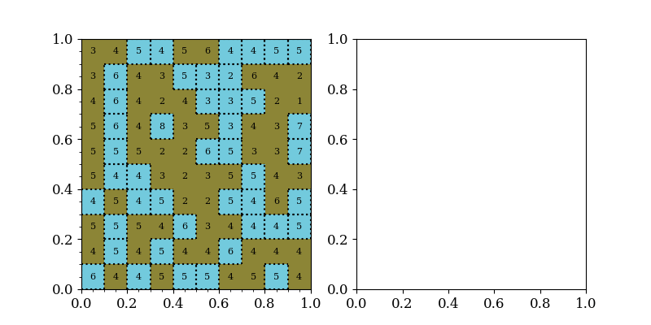
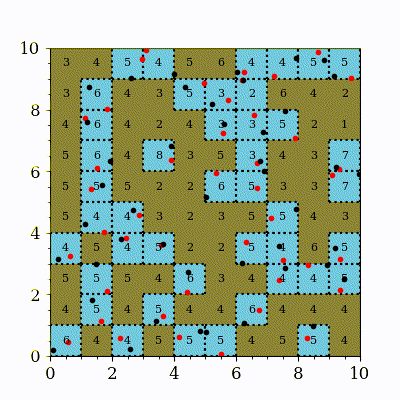

# corgi - C++ Object-oRiented Grid Infrastructure
#### (...or some other combination of relevant words that spell out another funny word.)
---


`corgi` is a c++ template library for building massively parallel grids.

It aims to be *completely* memory local, so every node will only need to work on the data that it currently sees/owns. Underlying communication is done using MPI (Message Passing Interface). Novelty is in the load balancing scheme that applies cellular automata kind of rules to even out load imbalances and tries, at the same time, to minimize the inter-node communication.

**This is still work-in-progress**

## In a nutshell:
- c++-17 compatible compiler is needed,
- add as a git submodule to your project, and
- add following to your `CMakeLists.txt`:

```
add_subdirectory (corgi)
target_link_library (<your_target> PRIVATE corgi)
```

## Examples

### Mesh-based simulation

`examples/game-of-life` implements a cellular automata simulation with a patch-based domain super decomposition parallellization strategy. After defining `send_data` and `recv_data` corgi can update boundary values of any kind of memory layout.



### Particle-based simulation
`examples/particles` implements a particle-based parallel simulation on top of corgi (also relying on patch-based domain super decomposition).



