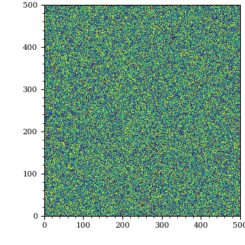
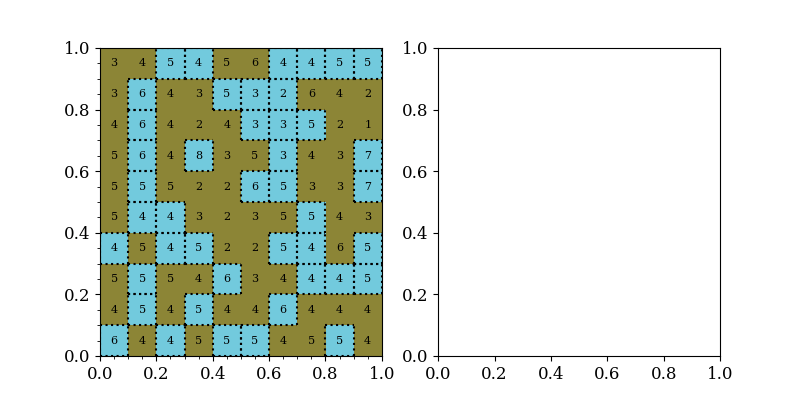
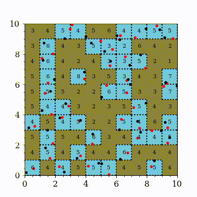

# corgi - C++ Object-oRiented Grid Infrastructure
#### (...or some other combination of relevant words that spell out another funny word.)
---



`corgi` is a c++ template library for building massively parallel grids.

It aims to be *completely* memory local, so every node will only need to work on the data that it currently sees/owns. Underlying communication is done using MPI (Message Passing Interface). Novelty is in the load balancing scheme that applies cellular automata kind of rules to even out load imbalances and tries, at the same time, to minimize the inter-node communication.

**This is still work-in-progress**

## Usage

Essentially corgi is a python package which is implemented as a shared library.
It is build with CMake and the python package uses scikit-build-core backend.
For development purposes and testing manual CMake building is supported.

Initialize submodules if they are not already initialized:

```
git submodule update --init --recursive
```

### Python package

```
pip install <path/to/corgi/repo>
```

### Manual CMake building and testing

Corgi tests require some dependencies which can be installed using pip (>=25.1)
(try upgrading pip if it is too old `pip install --upgrade pip`):

```
pip install --group <path/to/corgi/repo>/pyproject.toml:dev
```

Here is a minimal example of CMake usage to build and run tests.
Path to pybind11 installed at previous step is given manually.

```
PACKAGE_PATH=$(pip show pybind11 | grep Location | awk '{print $2}')
pybind11_DIR=$PACKAGE_PATH/pybind11/share/cmake/ cmake -B <build-dir> <path/to/corgi/repo>
cd <build-dir>
make
ctest
```

## Examples

These are available targets when manually building with CMake.

### Mesh-based simulation

`examples/game-of-life` implements a cellular automata simulation with a patch-based domain super decomposition parallellization strategy. After defining `send_data` and `recv_data` corgi can update boundary values of any kind of memory layout.



### Particle-based simulation
`examples/particles` implements a particle-based parallel simulation on top of corgi (also relying on patch-based domain super decomposition).



